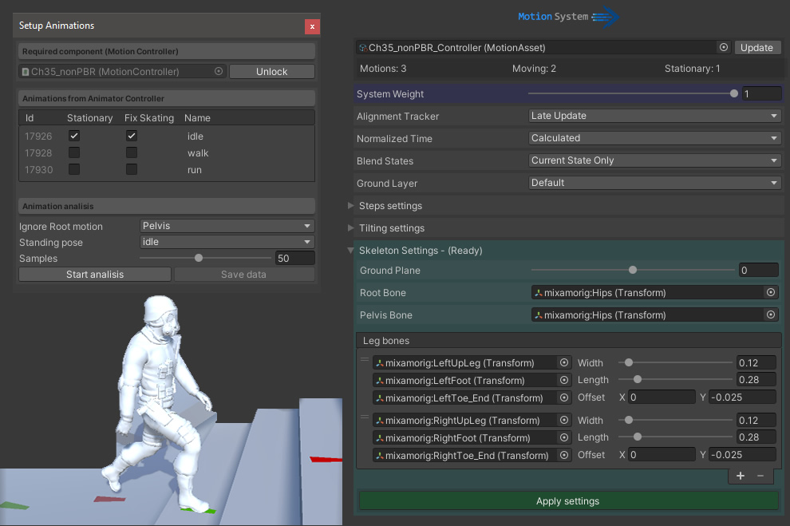
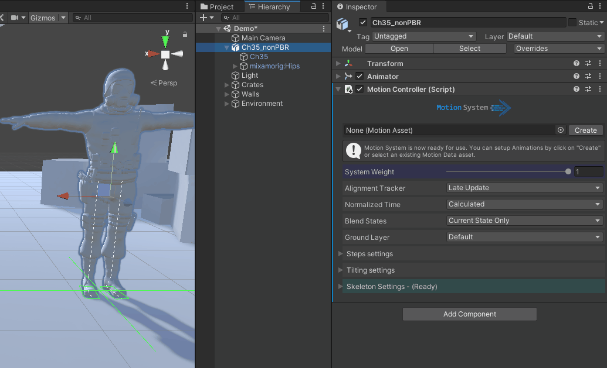

[![Contributors][contributors-shield]][contributors-url]
[![Forks][forks-shield]][forks-url]
[![Stargazers][stars-shield]][stars-url]
[![Issues][issues-shield]][issues-url]
[![MIT License][license-shield]][license-url]
[![LinkedIn][linkedin-shield]][linkedin-url]

<!-- PROJECT LOGO -->
 

  

  

    A possible replacement for the old Locomotion System that works with Mecanim Animator
     
    
     
     
    <a href="https://github.com/SteffanoDeMoura/MotionSystem/Project"><strong>Explore project »</strong></a>
     
    <a href="https://github.com/SteffanoDeMoura/MotionSystem/issues">Report Bug</a>
    <a href="https://github.com/SteffanoDeMoura/MotionSystem/issues">Request Feature</a>
  

<!-- TABLE OF CONTENTS -->
## Table of Contents

* [About the Project](#about-the-project)
  * [Built With](#built-with)
* [Getting Started](#getting-started)
  * [Prerequisites](#prerequisites)
  * [Installation](#installation)
* [Roadmap](#roadmap)
* [Contributing](#contributing)
* [License](#license)
* [Contact](#contact)

<!-- ABOUT THE PROJECT -->
## About The Project

Inspired by the project https://assetstore.unity.com/packages/tools/animation/locomotion-system-7135 this is an improved version with the same fundamentals as the original project. The code was almost all re-writen to support newer versions of Unity and also support Mecanim Animator.

A few key items:
* Improved performance
* Improved inspector
* Mecanim Animator
* No GC Allocations
* Less overhead using struct for data
* Motion analysis asset (can be shared and replaced at runtime)
* No need to setup skeleton again if adding or removing animations
* Motion analysis is a separated process from the character setup

Of course, the project is not perfect neither it will be the ideal solution for all cases, but it is an excellent starting point for making your personal adjustments according to the needs of your project. You may also suggest changes by forking this repo and creating a pull request or opening an issue.

### Built With
This project was built using:
* [Unity 2019.4.1f1](https://unity.com/)
* [Visual Studio Community](https://visualstudio.microsoft.com/pt-br/vs/community/)
* [Mixamo](https://www.mixamo.com/)

<!-- GETTING STARTED -->
## Getting Started

Grab a copy of the project by downloading the zip file or forking the project.
The folder Project contains the source code and a small demo if you wish to try it first. 

### Prerequisites

* You must have Unity Engine installed on your computer. The project was built using Unity 2019.4 but I guess you could run it with Unity 2017+ (not previously tested)
* You also need to have a 3d model fully rigged and ready to animate with Mecanim.

### Installation

1. Copy the folder MotionSystem to your project
2. Place your 3d model anywhere in your scene and add the MotionController component to it

3. Set the Animator Controller and Root bone 

4. Adjust the foot width and offset

5. Create the Motion analysis data 

-Motion file created

6. Add the DemoController component, Hit play and enjoy

if you wish to inspect the animations add the MotionDebugger component to your character and assign the Vertex material.

<!-- ROADMAP -->
## Roadmap

See the [open issues](https://github.com/SteffanoDeMoura/MotionSystem/issues) for a list of proposed features (and known issues).

<!-- CONTRIBUTING -->
## Contributing

Contributions are what make the open source community such an amazing place to be learn, inspire, and create. Any contributions you make are **greatly appreciated**.

1. Fork the Project
2. Create your Feature Branch (`git checkout -b feature/AmazingFeature`)
3. Commit your Changes (`git commit -m 'Add some AmazingFeature'`)
4. Push to the Branch (`git push origin feature/AmazingFeature`)
5. Open a Pull Request

<!-- LICENSE -->
## License

Distributed under the MIT License. See `LICENSE` for more information.

<!-- CONTACT -->
## Contact

Steffano de Moura - [Linkedin](https://www.linkedin.com/in/steffano-de-moura-aa9702131/) - fanolinux@gmail.com

Project Link: [https://github.com/SteffanoDeMoura/MotionSystem](https://github.com/SteffanoDeMoura/MotionSystem)

<!-- MARKDOWN LINKS & IMAGES -->
<!-- https://www.markdownguide.org/basic-syntax/#reference-style-links -->
[contributors-shield]: https://img.shields.io/github/contributors/othneildrew/Best-README-Template.svg?style=flat-square
[contributors-url]: https://github.com/othneildrew/Best-README-Template/graphs/contributors
[forks-shield]: https://img.shields.io/github/forks/othneildrew/Best-README-Template.svg?style=flat-square
[forks-url]: https://github.com/othneildrew/Best-README-Template/network/members
[stars-shield]: https://img.shields.io/github/stars/othneildrew/Best-README-Template.svg?style=flat-square
[stars-url]: https://github.com/othneildrew/Best-README-Template/stargazers
[issues-shield]: https://img.shields.io/github/issues/othneildrew/Best-README-Template.svg?style=flat-square
[issues-url]: https://github.com/othneildrew/Best-README-Template/issues
[license-shield]: https://img.shields.io/github/license/othneildrew/Best-README-Template.svg?style=flat-square
[license-url]: https://github.com/SteffanoDeMoura/MotionSystem/master/LICENSE.txt
[linkedin-shield]: https://img.shields.io/badge/-LinkedIn-black.svg?style=flat-square&logo=linkedin&colorB=555
[linkedin-url]: https://www.linkedin.com/in/steffano-de-moura-aa9702131/
[product-screenshot]: images/screenshot.png
